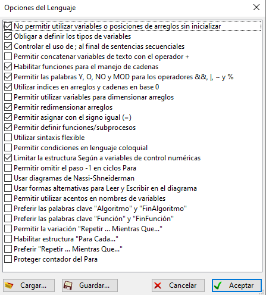

# Curso PSeInt

Curso de pseudocódigo con PSeInt

Descarga de PSeInt: https://pseint.sourceforge.net/?page=descargas.php

Perfil usado para los ejercicios:

## Videos completos

1. [Video con toda la teoria](https://youtu.be/nYrYhJf685U)
2. [Video con 50 ejercicios para practicar](https://youtu.be/WW9cn-bdVlQ)

## Como usar PSeInt

1. [¿Que es Pseudocodigo y PSeint?](https://youtu.be/rXGsxmIPlDc)
2. [Descarga e instalacion de Pseint](https://youtu.be/CKLnYlUWdoY)
3. [Como usar PSeInt](https://youtu.be/0yKq5JVEB4U)
4. [Configuración del perfil](https://youtu.be/Un2067BP3hQ)
5. [Ejemplo predefinidos](https://youtu.be/3sm_pfWdtw4)
6. [Ejecucción y depuración en PSeInt](https://youtu.be/a5Y4b6mAY4s)

## Teoria

1. [Variables](https://youtu.be/g598oxPP1O4)
2. [Leer/Escribir](https://youtu.be/CKLnYlUWdoY)
3. [Comentarios](https://youtu.be/0yKq5JVEB4U)
4. [Operadores](https://youtu.be/wvr2bA5ebJ4)
5. [Operadores algebraicos](https://youtu.be/EpqVM6cvLDE)
6. [Operadores relacionales](https://youtu.be/xEO1zBB02w8)
7. [Operadores lógicos](https://youtu.be/wojF1wahixA)
8. [Si entonces / sino](https://youtu.be/vqUyvmgcrKY)
9. [Segun](https://youtu.be/WhSRt6h-k8M)
10. [Mientras](https://youtu.be/XEDsrQWIsg0)
11. [Para](https://youtu.be/2RWeOtKBzpQ)
12. [Repetir](https://youtu.be/WBpwrN-1Yso)
13. [Subprocesos](https://youtu.be/jCM-MLbD09U)
14. [Subprocesos matemáticos](https://youtu.be/Gqn0YK84xng)
15. [Subprocesos cadenas](https://youtu.be/0PNDtTEZG6g)
16. [Subprocesos otros](https://youtu.be/RvcnHAT81qs)
17. [Paso por valor/referencias](https://youtu.be/8QQXSSueRW8)
18. [Arreglos](https://youtu.be/4FUpkS1QF24)
19. [Arreglos multidimensionales](https://youtu.be/NklW6Ud3qHQ)
20. [Arreglos en subprocesos](https://youtu.be/drXn9MuFS34)

#### Ejercicios

1. Escribe por pantalla "¡Hola mundo!"

2. Pide un nombre por teclado y muestra el siguiente mensaje: ¡Bienvenido <tu_nombre>!

3. Crea dos variables numericas y realiza las operaciones de suma, resta, multiplicacion y division.

4. Pide el precio de un producto, obten el valor del IVA y su valor final. IVA = 21%

5. Pide dos numeros enteros e indica cual de los dos es mayor.

6. Pide dos numeros enteros e indica cual de los dos es mayor, en caso de ser iguales, indicalo tambien.

7. Pide un numero e indica si es divisible con 2, es decir, que la division con 2 no queden decimales.

8. Pide un numero de mes y devuelve su equivalente en palabra. Por ejemplo, 3 -> Marzo

9. Muestra los numeros del 1 al 10 usando Mientras.

10. Muestra los numeros del 1 al 10 usando Para.

11. Muestra los numeros del 1 al 10 usando Repetir.

12. Muestra los numeros divisibles entre 2 y 3 de los 100 primeros numeros.

13. Muestra los numeros divisibles entre 2 o 3 de los 100 primeros numeros.

14. Valida que el numero introducido por teclado sea positivo.

15. Valida que el numero introducido por teclado este entre 0 y 10 (inclusive).

16. Introduce una nota entre 0 y 10 (inclusive) e indica la valoracion de la nota siguiendo el siguiente criterio:

- Entre 0 y 4: Insuficiente
- Si es igual a 5: Suficiente
- Entre 6 y 7: Bien
- Si es igual a 8: Notable
- Entre 9 y 10: Sobresaliente

17.  Muestra 10 numeros aleatorios entre 0 y 100.

18. Pide una palabra por teclado y muestra el numero de caracteres que tiene.

19. Pide una palabra por teclado y muestralas en mayusculas y minusculas.

20. Pide una palabra por teclado y recorre cada caracter.

21. Pide una palabra por teclado y elimina los espacios

22. Pide un numero e indica el numero de cifras que tiene

23. Crea un menu de opciones

24. Crea un arreglo de 10 posiciones e introduce los valores del 1 al 10

25. Crea un arreglo de 10 posiciones e introduce los valores aleatorios entre 0 y 100

26.  Crea un arreglo de 10 posiciones y pide un numero, almacena en el arreglo la tabla del 10 de ese numero.

Muestralo con el siguiente formato:
5 x 1 = 5
5 x 2 = 10
...

27. Crea un arreglo con los valores del 1 al 5.
    
Crea un segundo arreglo con los valores invertidos del primero.
    
Por ejemplo,  1,2,3,4,5   =>   5,4,3,2,1

28. Crea un arreglo y rellenalo con 10 notas entre 0 y 10 y cuenta cuantos suspensos y aprobados hay.

29. Crea un arreglo de 10 posiciones y rellenalo con numero aleatorios.

Busca cual es el numero minimo y maximo

30. Crea un arreglo de 10 posiciones, rellenalo con numero aleatorios y pide un numero por teclado e indica si existe en el arreglo.

31. Crea un arreglo de 10 posiciones, rellenalo con numero aleatorios y pide un numero por teclado.

Indica cuantas veces se repite en el arreglo.

32. Crea un arreglo de 6 posiciones y genera 6 numeros aleatorios entre 1 y 49. 

Los numeros no deben repetirse.

33. Crea 2 arreglos y fusionalos en uno nuevo.

Los arreglos deben tener diferente longitud.

Rellena los arreglos con numeros aleatorios.

34. Ordena de forma ascendente un arreglo de 10 posiciones con numeros aleatorios.

35. Crea una arreglo multidimensional de 3x3 con los numeros del 1 al 9 y muestralo de la siguiente forma:

1 2 3
4 5 6
7 8 9

36. Crea una arreglo multidimensional de 3x3, pide una fila por teclado y suma los valores de la misma.

37. Crea una arreglo multidimensional de 3x3, pide una columna por teclado y suma los valores de la misma.

38. Crea una arreglo multidimensional de 3x3 y suma los valores de la diagonal principal e inversa.

39. Crea una matriz con la tabla de multiplicar de 1 al 9, tendria que tener el siguiente aspecto:

&nbsp;&nbsp;&nbsp;&nbsp; 01 02 03 04 05 06 07 08 09
01 01 02 03 04 05 06 07 08 09
02 02 04 06 08 10 12 14 16 18
03 03 06 09 12 15 18 21 24 27
04 04 08 12 16 20 24 28 32 36
05 05 10 15 20 25 30 35 40 45
06 06 12 18 24 30 36 42 48 54
07 07 14 21 28 35 42 49 56 63
08 08 16 24 32 40 48 56 64 72
09 09 18 27 36 45 54 63 72 81

40. Crea un subproceso que escriba por pantalla "¡Hola mundo!"

41. Crea un subproceso con un argumento llamado nombre que nos salude.

42. Crea un subproceso que dado dos numeros como argumentos los sume y retorne el resultado.

43. Crea un subproceso para validar un numero que este entre dos numeros dados por argumentos.

44. Crea un subproceso para validar un numero que este entre dos numeros dados. 

No debe devolver el numero, debes pasarselo como referencia.

45. Crea un subproceso para mostrar un arreglo pasado por argumento.

46. Crea un subproceso para rellenar un arreglo con numeros aleatorios.

47. Crea un subproceso para ordenar ascendentemente un arreglo.

48.  Crea un subproceso para mostrar una matriz.

49. Crea un subproceso para rellenar una matriz con numeros aleatorios entre dos numeros

50. Vamos a gestionar las ventas de un mes con una matriz de 5x7, tendremos un menu con las siguientes opciones:

- Añadir venta: pedimos un dia, calculamos la coordenada exacta y añadimos la venta. En caso de que ya exista una venta, la sumamos.
- Total de ventas: Mostramos el total de ventas
- Total de ventas en una semana: Pedimos una semana y sumamos las ventas de esa semana 
- Mostrar ventas: Mostramos la matriz de las ventas
- Salir
